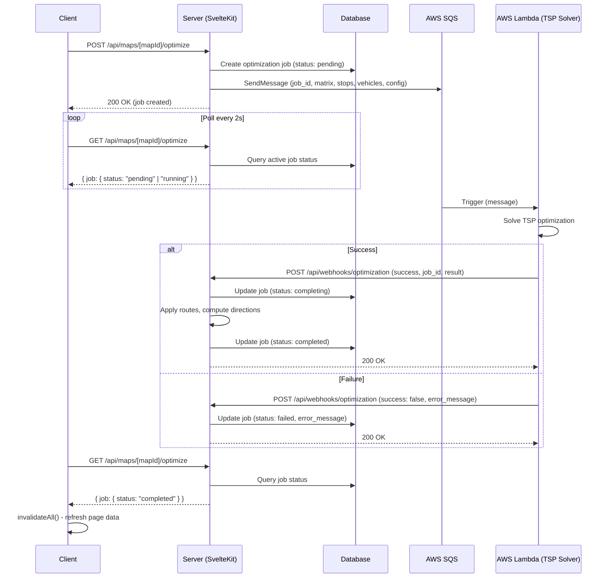

Flow Summary:

| Step | From   | To     | Action                     |
| ---- | ------ | ------ | -------------------------- |
| 1    | Client | Server | Request optimization       |
| 2    | Server | DB     | Create job (pending)       |
| 3    | Server | SQS    | Queue optimization payload |
| 4    | Client | Server | Poll for status (every 2s) |
| 5    | SQS    | Lambda | Trigger solver             |
| 6    | Lambda | Lambda | Run OR-Tools TSP solver    |
| 7    | Lambda | Server | Webhook with result        |
| 8    | Server | DB     | Update job + apply routes  |
| 9    | Client | Server | Poll detects completion    |
| 10   | Client | Client | Refresh UI with new routes |
